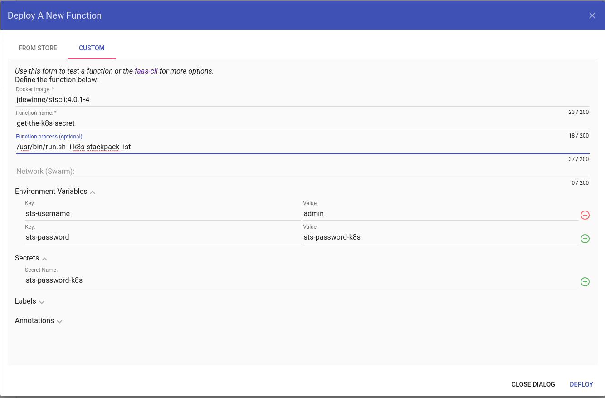

# StackState CLI for OpenFaas

## Prerequisites

+ Have OpenFaas installed

## Usage

1. Change `sts-cli.yml` gateway to your OpenFaas Gateway.
1. Deploy your StackState password as a [secret](https://docs.openfaas.com/reference/secrets/#define-a-secret-in-kubernetes-advanced) into your k8s cluster. Use the pattern `sts-password-[instance]` for the secret name.
1. Run `faas-cli deploy -f stscli.yml`.
1. Deploy your function via the Gateway UI
